# 光照

虽然我们的场景是 3D 的，但它们看起来像是平的，**对象**表面缺乏现实光照环境中的明暗变化，所以无法体现模型的三维特性。这是因为我们的模型没有考虑光线和对象表面之间的相互作用，无论如何摆放都会保持着相同的着色。

如果想修正这一点，就需要在我们的场景中添加**光照**（Lighting）。

在现实世界中，光源发出的光子会四处反射，最后进入我们的眼睛。
当观察对象上的一点时，我们所看到的颜色取决于多个光源和多个反射表面之间的多次相互作用。

在计算机图形学领域，为单个光子建模的计算成本极高。一个 100 瓦的灯泡每秒钟发出大约 3.27×10^20 个光子，再试想一下太阳每秒发出的光子的数量级。为了解决这个问题，我们要用数学来 **“作弊”**（也就是**模拟**。严格来说，这不是作弊，计算机图形学里有这么一句名言："If it looks right, it is right.", 意思就是，如果它看起来是对的，那么它就是对的）。

我们来看看计算机图形学里常用的几个**光照**模型。

## 光线/路径追踪

**光线/路径追踪**（Ray/Path tracing）以虛拟摄像机模型为基础，但是对于每条与某个三角形相交的投影线，在计算光源对交点处明暗值的直接贡献之前，还要确定是否有一个或者多个光源能够照射到这个交点。

它是最接近光的真实工作方式的模型，所以我觉得必须提到它。但这是一个*高级*话题，我们不会在这里深入讨论。

## Blinn-Phong 反射模型

对于大多数**实时**（real-time）应用来说，**光线/路径追踪**的计算成本实在太高了（尽管这种情况已经开始改变），所以通常使用一种更有效的，精度较低的 [Phong 反射模型](https://en.wikipedia.org/wiki/Phong_shading) 来解决光照问题。它考虑了光线与材质的 3 种相互作用：环境光反射、漫反射和镜面反射。我们将学习 [Blinn-Phong 反射模型](https://en.wikipedia.org/wiki/Blinn%E2%80%93Phong_reflection_model)，它能加速镜面反射的计算。

在开始学习之前，需要在我们的场景中添加一个光源：

```rust
// lib.rs
#[repr(C)]
#[derive(Debug, Copy, Clone, bytemuck::Pod, bytemuck::Zeroable)]
struct LightUniform {
    position: [f32; 3],
    // 由于 Uniform 需要字段按 16 字节对齐，我们需要在这里使用一个填充字段
    _padding: u32,
    color: [f32; 3],
    _padding2: u32,
}
```

`LightUniform` 代表空间中的一个彩色点光源。虽然通常是使用纯白色的光，但使用其它颜色的光也是可以的。

<div class="note">

使 WGSL **结构体**内存字节对齐的经验法则是：字段保持按 2 的 N 次幂来对齐。
例如，一个 `vec3` 如果是 3 个单精度浮点数，它的大小为 12 字节，对齐后将被提升到 2 的下一个次幂，即 16 字节. 这意味着必须更加小心地布局你的结构体。

一些开发者会选择使用 `vec4` 而不是 `vec3` 来避免对齐问题。
你可以在 [wgsl spec](https://www.w3.org/TR/WGSL/#alignment-and-size) 中了解更多关于对齐规则的信息。

</div>

接下来，创建一个 Uniform 缓冲区来存储我们的光源：

```rust
let light_uniform = LightUniform {
    position: [2.0, 2.0, 2.0],
    _padding: 0,
    color: [1.0, 1.0, 1.0],
    _padding2: 0,
};

 // 我们希望能更新光源位置，所以用了 COPY_DST 这个使用范围标志
let light_buffer = device.create_buffer_init(
    &wgpu::util::BufferInitDescriptor {
        label: Some("Light VB"),
        contents: bytemuck::cast_slice(&[light_uniform]),
        usage: wgpu::BufferUsages::UNIFORM | wgpu::BufferUsages::COPY_DST,
    }
);
```

别忘记把 `light_uniform` 和 `light_buffer` 添加到 `WgpuApp`。之后，我们为光源创建一个绑定组的**布局**及**绑定组**：

```rust
let light_bind_group_layout =
    device.create_bind_group_layout(&wgpu::BindGroupLayoutDescriptor {
        entries: &[wgpu::BindGroupLayoutEntry {
            binding: 0,
            visibility: wgpu::ShaderStages::VERTEX | wgpu::ShaderStages::FRAGMENT,
            ty: wgpu::BindingType::Buffer {
                ty: wgpu::BufferBindingType::Uniform,
                has_dynamic_offset: false,
                min_binding_size: None,
            },
            count: None,
        }],
        label: None,
    });

let light_bind_group = device.create_bind_group(&wgpu::BindGroupDescriptor {
    layout: &light_bind_group_layout,
    entries: &[wgpu::BindGroupEntry {
        binding: 0,
        resource: light_buffer.as_entire_binding(),
    }],
    label: None,
});
```

把它们添加到 `WgpuApp` 中，同时更新 `render_pipeline_layout`：

```rust
let render_pipeline_layout = device.create_pipeline_layout(&wgpu::PipelineLayoutDescriptor {
    bind_group_layouts: &[
        &texture_bind_group_layout,
        &camera_bind_group_layout,
        &light_bind_group_layout,
    ],
});
```

在 `update()` 函数中更新光源的位置，这样便能看到**对象**在不同角度下的光照效果：

```rust
// 更新光源
let old_position = glam::Vec3::from_array(self.light_uniform.position);
self.light_uniform.position =
    (glam::Quat::from_axis_angle(glam::Vec3::Y, consts::PI / 180.)
        * old_position).into();
self.queue.write_buffer(&self.light_buffer, 0, bytemuck::cast_slice(&[self.light_uniform]));
```

上面的代码使光源围绕原点以每**帧** 1 度的速度旋转。

## 查看光源

出于调试的目的，如果能够查看**光源**本身的位置，以确保场景的**光照**效果是正确的，那就太好了。

尽管可以直接调整现有的**渲染管线**来绘制光源，但这可能不利于代码的维护。所以我们把创建渲染管线的代码提取到一个叫做 `create_render_pipeline()` 的新函数中：

```rust
fn create_render_pipeline(
    device: &wgpu::Device,
    layout: &wgpu::PipelineLayout,
    color_format: wgpu::TextureFormat,
    depth_format: Option<wgpu::TextureFormat>,
    vertex_layouts: &[wgpu::VertexBufferLayout],
    shader: wgpu::ShaderModuleDescriptor,
) -> wgpu::RenderPipeline {
    let shader = device.create_shader_module(shader);

    device.create_render_pipeline(&wgpu::RenderPipelineDescriptor {
        label: Some("Render Pipeline"),
        layout: Some(layout),
        vertex: wgpu::VertexState {
            module: &shader,
            entry_point: "vs_main",
            compilation_options: Default::default(),
            buffers: vertex_layouts,
        },
        fragment: Some(wgpu::FragmentState {
            module: &shader,
            entry_point: "fs_main",
            compilation_options: Default::default(),
            targets: &[Some(wgpu::ColorTargetState {
                format: color_format,
                blend: Some(wgpu::BlendState {
                    alpha: wgpu::BlendComponent::REPLACE,
                    color: wgpu::BlendComponent::REPLACE,
                }),
                write_mask: wgpu::ColorWrites::ALL,
            })],
        }),
        primitive: wgpu::PrimitiveState {
            topology: wgpu::PrimitiveTopology::TriangleList,
            strip_index_format: None,
            front_face: wgpu::FrontFace::Ccw,
            cull_mode: Some(wgpu::Face::Back),
            // 此处设置为 Fill 以外的任何值都需要开启 Feature::NON_FILL_POLYGON_MODE
            polygon_mode: wgpu::PolygonMode::Fill,
            unclipped_depth: false,
            conservative: false,
        },
        depth_stencil: depth_format.map(|format| wgpu::DepthStencilState {
            format,
            depth_write_enabled: true,
            depth_compare: wgpu::CompareFunction::Less,
            stencil: wgpu::StencilState::default(),
            bias: wgpu::DepthBiasState::default(),
        }),
        multisample: wgpu::MultisampleState {
            count: 1,
            mask: !0,
            alpha_to_coverage_enabled: false,
        },
    })
}
```

修改 `WgpuApp::new()` 中的代码来调用 `create_render_pipeline` 函数：

```rust
let render_pipeline = {
    let shader = wgpu::ShaderModuleDescriptor {
        label: Some("Normal Shader"),
        source: wgpu::ShaderSource::Wgsl(include_str!("shader.wgsl").into()),
    };
    create_render_pipeline(
        &device,
        &render_pipeline_layout,
        config.format,
        Some(texture::Texture::DEPTH_FORMAT),
        &[model::ModelVertex::desc(), InstanceRaw::desc()],
        shader,
    )
};
```

修改 `model::DrawModel` 以使用 `light_bind_group`：

```rust
// model.rs
pub trait DrawModel<'a> {
    fn draw_mesh(
        &mut self,
        mesh: &'a Mesh,
        material: &'a Material,
        camera_bind_group: &'a wgpu::BindGroup,
        light_bind_group: &'a wgpu::BindGroup,
    );
    fn draw_mesh_instanced(
        &mut self,
        mesh: &'a Mesh,
        material: &'a Material,
        instances: Range<u32>,
        camera_bind_group: &'a wgpu::BindGroup,
        light_bind_group: &'a wgpu::BindGroup,
    );

    fn draw_model(
        &mut self,
        model: &'a Model,
        camera_bind_group: &'a wgpu::BindGroup,
        light_bind_group: &'a wgpu::BindGroup,
    );
    fn draw_model_instanced(
        &mut self,
        model: &'a Model,
        instances: Range<u32>,
        camera_bind_group: &'a wgpu::BindGroup,
        light_bind_group: &'a wgpu::BindGroup,
    );
}

impl<'a, 'b> DrawModel<'b> for wgpu::RenderPass<'a>
where
    'b: 'a,
{
    fn draw_mesh(
        &mut self,
        mesh: &'b Mesh,
        material: &'b Material,
        camera_bind_group: &'b wgpu::BindGroup,
        light_bind_group: &'b wgpu::BindGroup,
    ) {
        self.draw_mesh_instanced(mesh, material, 0..1, camera_bind_group, light_bind_group);
    }

    fn draw_mesh_instanced(
        &mut self,
        mesh: &'b Mesh,
        material: &'b Material,
        instances: Range<u32>,
        camera_bind_group: &'b wgpu::BindGroup,
        light_bind_group: &'b wgpu::BindGroup,
    ) {
        self.set_vertex_buffer(0, mesh.vertex_buffer.slice(..));
        self.set_index_buffer(mesh.index_buffer.slice(..), wgpu::IndexFormat::Uint32);
        self.set_bind_group(0, &material.bind_group, &[]);
        self.set_bind_group(1, camera_bind_group, &[]);
        self.set_bind_group(2, light_bind_group, &[]);
        self.draw_indexed(0..mesh.num_elements, 0, instances);
    }

    fn draw_model(
        &mut self,
        model: &'b Model,
        camera_bind_group: &'b wgpu::BindGroup,
        light_bind_group: &'b wgpu::BindGroup,
    ) {
        self.draw_model_instanced(model, 0..1, camera_bind_group, light_bind_group);
    }

    fn draw_model_instanced(
        &mut self,
        model: &'b Model,
        instances: Range<u32>,
        camera_bind_group: &'b wgpu::BindGroup,
        light_bind_group: &'b wgpu::BindGroup,
    ) {
        for mesh in &model.meshes {
            let material = &model.materials[mesh.material];
            self.draw_mesh_instanced(mesh, material, instances.clone(), camera_bind_group, light_bind_group);
        }
    }
}
```

完成这些后，就可以为我们的光源创建另一条渲染管线了：

```rust
// lib.rs
let light_render_pipeline = {
    let layout = device.create_pipeline_layout(&wgpu::PipelineLayoutDescriptor {
        label: Some("Light Pipeline Layout"),
        bind_group_layouts: &[&camera_bind_group_layout, &light_bind_group_layout],
        push_constant_ranges: &[],
    });
    let shader = wgpu::ShaderModuleDescriptor {
        label: Some("Light Shader"),
        source: wgpu::ShaderSource::Wgsl(include_str!("light.wgsl").into()),
    };
    create_render_pipeline(
        &device,
        &layout,
        config.format,
        Some(texture::Texture::DEPTH_FORMAT),
        &[model::ModelVertex::desc()],
        shader,
    )
};
```

我选择为 `light_render_pipeline` 创建一个单独的**布局**，因为它不需要常规**渲染管线**所需要的资源（主要是纹理）。

之后，我们来编写实际的着色器代码：

```rust
// light.wgsl
// 顶点着色器

struct Camera {
    view_proj: mat4x4f,
}
@group(0) @binding(0)
var<uniform> camera: Camera;

struct Light {
    position: vec3f,
    color: vec3f,
}
@group(1) @binding(0)
var<uniform> light: Light;

struct VertexInput {
    @location(0) position: vec3f,
};

struct VertexOutput {
    @builtin(position) clip_position: vec4f,
    @location(0) color: vec3f,
};

@vertex
fn vs_main(
    model: VertexInput,
) -> VertexOutput {
    let scale = 0.25;
    var out: VertexOutput;
    out.clip_position = camera.view_proj * vec4f(model.position * scale + light.position, 1.0);
    out.color = light.color;
    return out;
}

// 片元着色器

@fragment
fn fs_main(in: VertexOutput) -> @location(0) vec4f {
    return vec4f(in.color, 1.0);
}
```

现在就能在 `render()` 函数中手动实现光源的绘制代码了，但是为了保持之前开发的绘制模式，让我们来创建一个名为 `DrawLight` 的新 trait：

```rust
// model.rs
pub trait DrawLight<'a> {
    fn draw_light_mesh(
        &mut self,
        mesh: &'a Mesh,
        camera_bind_group: &'a wgpu::BindGroup,
        light_bind_group: &'a wgpu::BindGroup,
    );
    fn draw_light_mesh_instanced(
        &mut self,
        mesh: &'a Mesh,
        instances: Range<u32>,
        camera_bind_group: &'a wgpu::BindGroup,
        light_bind_group: &'a wgpu::BindGroup,
    );

    fn draw_light_model(
        &mut self,
        model: &'a Model,
        camera_bind_group: &'a wgpu::BindGroup,
        light_bind_group: &'a wgpu::BindGroup,
    );
    fn draw_light_model_instanced(
        &mut self,
        model: &'a Model,
        instances: Range<u32>,
        camera_bind_group: &'a wgpu::BindGroup,
        light_bind_group: &'a wgpu::BindGroup,
    );
}

impl<'a, 'b> DrawLight<'b> for wgpu::RenderPass<'a>
where
    'b: 'a,
{
    fn draw_light_mesh(
        &mut self,
        mesh: &'b Mesh,
        camera_bind_group: &'b wgpu::BindGroup,
        light_bind_group: &'b wgpu::BindGroup,
    ) {
        self.draw_light_mesh_instanced(mesh, 0..1, camera_bind_group, light_bind_group);
    }

    fn draw_light_mesh_instanced(
        &mut self,
        mesh: &'b Mesh,
        instances: Range<u32>,
        camera_bind_group: &'b wgpu::BindGroup,
        light_bind_group: &'b wgpu::BindGroup,
    ) {
        self.set_vertex_buffer(0, mesh.vertex_buffer.slice(..));
        self.set_index_buffer(mesh.index_buffer.slice(..), wgpu::IndexFormat::Uint32);
        self.set_bind_group(0, camera_bind_group, &[]);
        self.set_bind_group(1, light_bind_group, &[]);
        self.draw_indexed(0..mesh.num_elements, 0, instances);
    }

    fn draw_light_model(
        &mut self,
        model: &'b Model,
        camera_bind_group: &'b wgpu::BindGroup,
        light_bind_group: &'b wgpu::BindGroup,
    ) {
        self.draw_light_model_instanced(model, 0..1, camera_bind_group, light_bind_group);
    }
    fn draw_light_model_instanced(
        &mut self,
        model: &'b Model,
        instances: Range<u32>,
        camera_bind_group: &'b wgpu::BindGroup,
        light_bind_group: &'b wgpu::BindGroup,
    ) {
        for mesh in &model.meshes {
            self.draw_light_mesh_instanced(mesh, instances.clone(), camera_bind_group, light_bind_group);
        }
    }
}
```

最后，在渲染通道中加入光源的渲染：

```rust
impl WgpuAppAction for WgpuApp {
    // ...
    fn render(&mut self) -> Result<(), wgpu::SurfaceError> {
        // ...
        render_pass.set_vertex_buffer(1, self.instance_buffer.slice(..));

        use crate::model::DrawLight; // 新增!
        render_pass.set_pipeline(&self.light_render_pipeline); // 新增!
        render_pass.draw_light_model(
            &self.obj_model,
            &self.camera_bind_group,
            &self.light_bind_group,
        ); // 新增!

        render_pass.set_pipeline(&self.render_pipeline);
        render_pass.draw_model_instanced(
            &self.obj_model,
            0..self.instances.len() as u32,
            &self.camera_bind_group,
            &self.light_bind_group, // 新增
        );
}
```

完成上面这些后，我们将看到如下渲染效果：

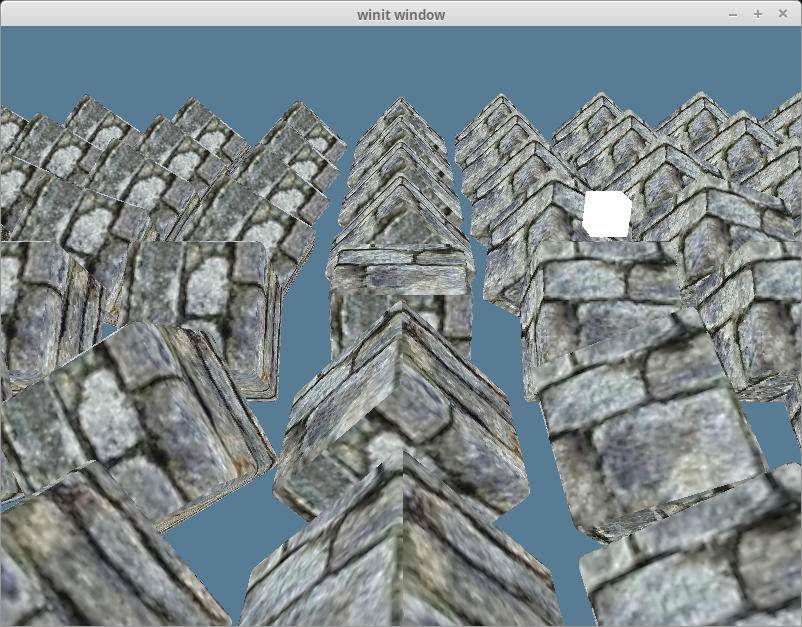

## 环境光反射

现实世界中，光线在进入我们的眼睛之前往往在物体表面之间经历了多次**反射**。这就是为什么你能看见阴影区域的东西。在计算机上实现这种互动模型很昂贵，所以需要“作弊”（模拟）。

**环境光反射**（Ambient Reflection）定义了对象表面所有点的环境光**强度**相同，代表从场景的其他部分反射过来的光照亮我们的**对象**。
环境光反射值 = 光源颜色 _ 环境光强度 _ 片元的颜色。

请在 `shader.wgsl` 中的**纹理** Uniform 之下添加以下代码：

```rust
struct Light {
    position: vec3f,
    color: vec3f,
}
@group(2) @binding(0)
var<uniform> light: Light;
```

然后更新片元色器代码来计算和使用环境光的色值：

```rust
@fragment
fn fs_main(in: VertexOutput) -> @location(0) vec4f {
    let object_color: vec4f = textureSample(t_diffuse, s_diffuse, in.tex_coords);

    // 我们不需要太强的环境光，强度设置为 0.1 就够了
    let ambient_strength = 0.1;
    let ambient_color = light.color * ambient_strength;

    let result = ambient_color * object_color.rgb;

    return vec4f(result, object_color.a);
}
```

完成上面的修改后，我们将得到如下渲染效果：

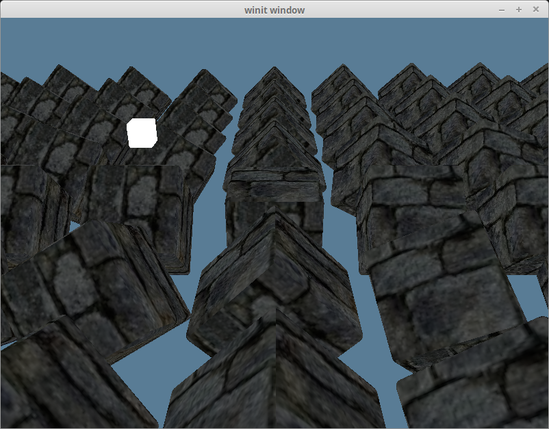

## 漫反射

理想的**漫反射**（Diffuse Reflection）**表面**将光线向所有方向均匀地散射，因此，这样的表面在所有的观察者看来亮度都一样。不过，反射出去的光线强度依赖于**材质**以及光源相对于表面的位置。

还记得我们的模型中包含的**法向量**（Normal Vector）吗？现在终于要使用它们了。
**法向量**（也叫做法线）代表一个表面的朝向。通过计算**片元**的法向量和它指向光源的向量之间的夹角，可以得到该片元**漫反射**强度值。我们使用点积来计算向量之间夹角的**余弦**值：

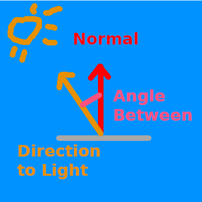

如果**法向量**和光源方向向量的点积为 1.0，则表示当前片元与光源对齐，将反射光线的全部强度。值为 0 或更低表示表面垂直于或远离光源，因此反射强度小。

我们将**法向量**加入到 `shader.wgsl` 中：

```rust
struct VertexInput {
    @location(0) position: vec3f,
    @location(1) tex_coords: vec2f,
    @location(2) normal: vec3f, // 新增!
};
```

接着定义该值以及顶点的位置来传递给片元着色器：

```rust
struct VertexOutput {
    @builtin(position) clip_position: vec4f,
    @location(0) tex_coords: vec2f,
    @location(1) world_normal: vec3f,
    @location(2) world_position: vec3f,
};
```

我们先按原样传递法向量的值。这是错误的，稍后会修复它：

```rust
@vertex
fn vs_main(
    model: VertexInput,
    instance: InstanceInput,
) -> VertexOutput {
    let model_matrix = mat4x4f(
        instance.model_matrix_0,
        instance.model_matrix_1,
        instance.model_matrix_2,
        instance.model_matrix_3,
    );
    var out: VertexOutput;
    out.tex_coords = model.tex_coords;
    out.world_normal = model.normal;
    var world_position: vec4f = model_matrix * vec4f(model.position, 1.0);
    out.world_position = world_position.xyz;
    out.clip_position = camera.view_proj * world_position;
    return out;
}
```

现在来进行实际的计算，在 `ambient_color` 和 `result` 代码行之间，添加如下代码：

```rust
let light_dir = normalize(light.position - in.world_position);

let diffuse_strength = max(dot(in.world_normal, light_dir), 0.0);
let diffuse_color = light.color * diffuse_strength;
```

然后在 `result` 中包含漫反射光（`diffuse_color`）:

```rust
let result = (ambient_color + diffuse_color) * object_color.xyz;
```

完成后，我们将获得如下渲染效果：

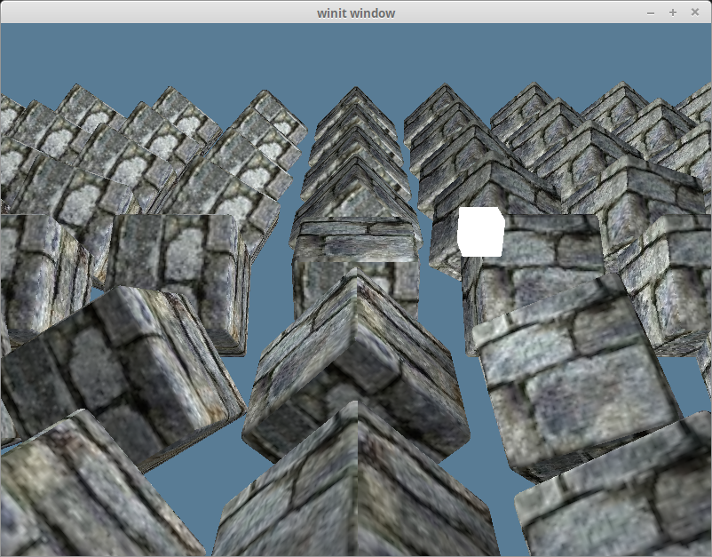

## 法线矩阵

还记得我说过将顶点**法向量**直接传递给片元着色器是错误的吗？我们通过只在场景中保留一个在 y 轴上旋转了 180 度的立方体来探索这一点：

```rust
const NUM_INSTANCES_PER_ROW: u32 = 1;

// In the loop we create the instances in
let rotation = glam::Quat::from_axis_angle(glam::Vec3::Y, (180.0).to_radians());
```

同时从 `result` 中移除环境光 `ambient_color`：

```rust
let result = (diffuse_color) * object_color.xyz;
```

我们将得到如下渲染效果：

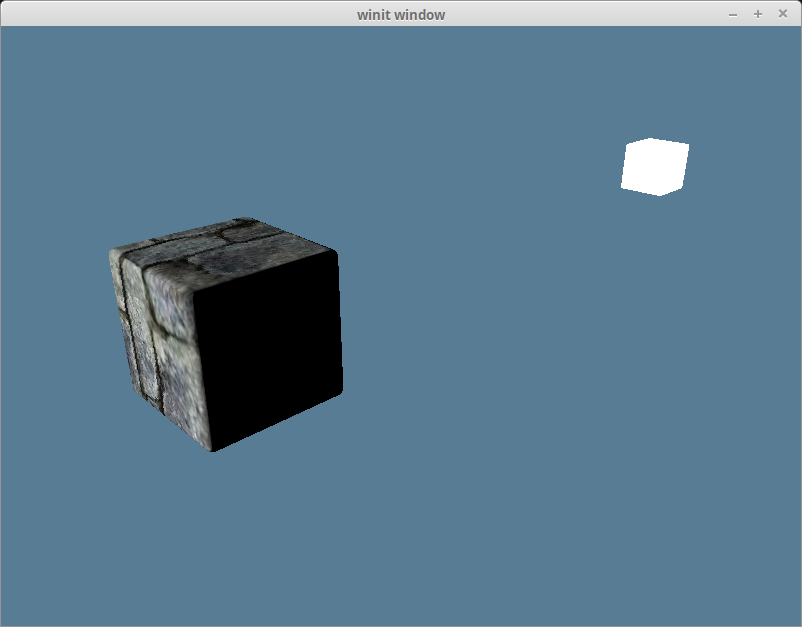

渲染结果显然是错误的，因为光线照亮了立方体的背光侧。这是由于**法向量**并没有随对象一起旋转，因此无论对象转向哪个方向，法向量的方向始终没变：

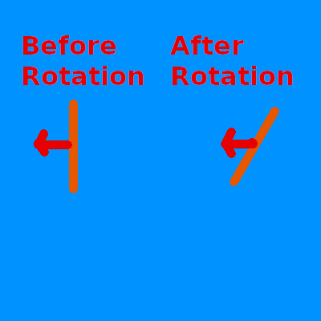

我们将使用**法线矩阵**（Normal Matrix）将**法向量**变换为正确的方向。需要注意的是，法向量表示一个方向，它应该做为**单位向量**（Unit Vector）来参与整个计算过程。

虽然可以在顶点着色器中计算**法线矩阵**，但这涉及到反转模型矩阵 `model_matrix`，而 WGSL 实际上没有矩阵求逆的函数，必须自己编写此代码。更重要的是，矩阵求逆的计算在着色器里实际上非常昂贵，特别是每个顶点都要计算一遍。

我们的替代方案是，向 `InstanceRaw` 结构体添加一个 `normal` 字段。不用去反转**模型矩阵**，而是使用模型实例的旋转来创建一个 `Matrix3` 类型的法线矩阵。

<div class="note">

我们只需要用到矩阵的旋转分量，故**法线矩阵**的类型是 `Matrix3` 而不是 `Matrix4`。

</div>

```rust
#[repr(C)]
#[derive(Debug, Copy, Clone, bytemuck::Pod, bytemuck::Zeroable)]
#[allow(dead_code)]
struct InstanceRaw {
    model: [[f32; 4]; 4],
    normal: [[f32; 3]; 3],
}

impl model::Vertex for InstanceRaw {
    fn desc<'a>() -> wgpu::VertexBufferLayout<'a> {
        use core::mem;
        wgpu::VertexBufferLayout {
            array_stride: mem::size_of::<InstanceRaw>() as wgpu::BufferAddress,
            // step_mode 的值需要从 Vertex 改为 Instance
            // 这意味着只有着色器开始处理一次新实例化绘制时，才会使用下一个实例数据
            step_mode: wgpu::VertexStepMode::Instance,
            attributes: &[
                wgpu::VertexAttribute {
                    offset: 0,
                    // 虽然顶点着色器现在只使用了插槽 0 和 1，但在后面的教程中将会使用 2、3 和 4
                    // 此处从插槽 5 开始，确保与后面的教程不会有冲突
                    shader_location: 5,
                    format: wgpu::VertexFormat::Float32x4,
                },
                // mat4 从技术的角度来看是由 4 个 vec4 构成，占用 4 个插槽。
                // 我们需要为每个 vec4 定义一个插槽，然后在着色器中重新组装出 mat4。
                wgpu::VertexAttribute {
                    offset: mem::size_of::<[f32; 4]>() as wgpu::BufferAddress,
                    shader_location: 6,
                    format: wgpu::VertexFormat::Float32x4,
                },
                wgpu::VertexAttribute {
                    offset: mem::size_of::<[f32; 8]>() as wgpu::BufferAddress,
                    shader_location: 7,
                    format: wgpu::VertexFormat::Float32x4,
                },
                wgpu::VertexAttribute {
                    offset: mem::size_of::<[f32; 12]>() as wgpu::BufferAddress,
                    shader_location: 8,
                    format: wgpu::VertexFormat::Float32x4,
                },
                // 新增!
                wgpu::VertexAttribute {
                    offset: mem::size_of::<[f32; 16]>() as wgpu::BufferAddress,
                    shader_location: 9,
                    format: wgpu::VertexFormat::Float32x3,
                },
                wgpu::VertexAttribute {
                    offset: mem::size_of::<[f32; 19]>() as wgpu::BufferAddress,
                    shader_location: 10,
                    format: wgpu::VertexFormat::Float32x3,
                },
                wgpu::VertexAttribute {
                    offset: mem::size_of::<[f32; 22]>() as wgpu::BufferAddress,
                    shader_location: 11,
                    format: wgpu::VertexFormat::Float32x3,
                },
            ],
        }
    }
}
```

然后修改 `Instance` 以创建法线矩阵：

```rust
struct Instance {
    position: glam::Vec3,
    rotation: glam::Quat,
}

impl Instance {
    fn to_raw(&self) -> InstanceRaw {
        let model =
            glam::Mat4::from_translation(self.position) * glam::Mat4::from_quat(self.rotation);
        InstanceRaw {
            model: model.to_cols_array_2d(),
            // 新增!
            normal: glam::Mat3::from_mat4(glam::Mat4::from_quat(self.rotation)).to_cols_array_2d(),
        }
    }
}
```

现在，我们在顶点着色器中重构法线矩阵：

```rust
struct InstanceInput {
    @location(5) model_matrix_0: vec4f,
    @location(6) model_matrix_1: vec4f,
    @location(7) model_matrix_2: vec4f,
    @location(8) model_matrix_3: vec4f,
    // 新增!
    @location(9) normal_matrix_0: vec3f,
    @location(10) normal_matrix_1: vec3f,
    @location(11) normal_matrix_2: vec3f,
};

struct VertexOutput {
    @builtin(position) clip_position: vec4f,
    @location(0) tex_coords: vec2f,
    @location(1) world_normal: vec3f,
    @location(2) world_position: vec3f,
};

@vertex
fn vs_main(
    model: VertexInput,
    instance: InstanceInput,
) -> VertexOutput {
    let model_matrix = mat4x4f(
        instance.model_matrix_0,
        instance.model_matrix_1,
        instance.model_matrix_2,
        instance.model_matrix_3,
    );
    // 新增!
    let normal_matrix = mat3x3f(
        instance.normal_matrix_0,
        instance.normal_matrix_1,
        instance.normal_matrix_2,
    );
    var out: VertexOutput;
    out.tex_coords = model.tex_coords;
    out.world_normal = normal_matrix * model.normal; // UPDATED!
    var world_position: vec4f = model_matrix * vec4f(model.position, 1.0);
    out.world_position = world_position.xyz;
    out.clip_position = camera.view_proj * world_position;
    return out;
}
```

<div class="note">

上边的实现是基于 [世界空间](https://gamedev.stackexchange.com/questions/65783/what-are-world-space-and-eye-space-in-game-development) 的。在**视图空间**（view-space），也就是**眼空间**（eye-space）来实现是更标准的做法，因为对象在离**原点**较远的地方会产生光照问题。
如果改为使用视图空间，就需要包括由**视图矩阵**产生的旋转。还须使用 `view_matrix * model_matrix * light_position` 来变换光源的位置，以防止摄像机移动后产生计算错误。

使用视图空间的最大优势是：能避免在大规模的场景中进行**光照**和其他计算时，由于**对象**之间的空间间距导致的问题。
因为当数字变得非常大时，浮点数精度会下降。视图空间使摄像机保持在**原点**，这意味着所有的计算都会使用较小的数字。
最终的光照计算过程是一样的，只是需要多一点点设置。

</div>

经过以上修改，光照效果现在看起来已经正确了：

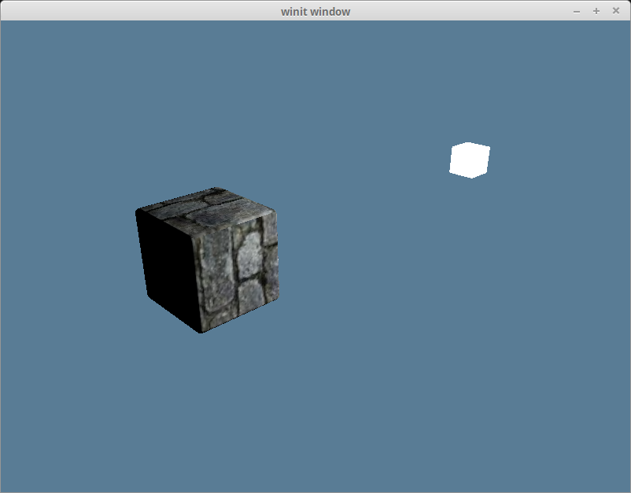

现在把场景中其他**对象**加回来，再加上**环境光反射**，我们就会得到如下渲染效果：

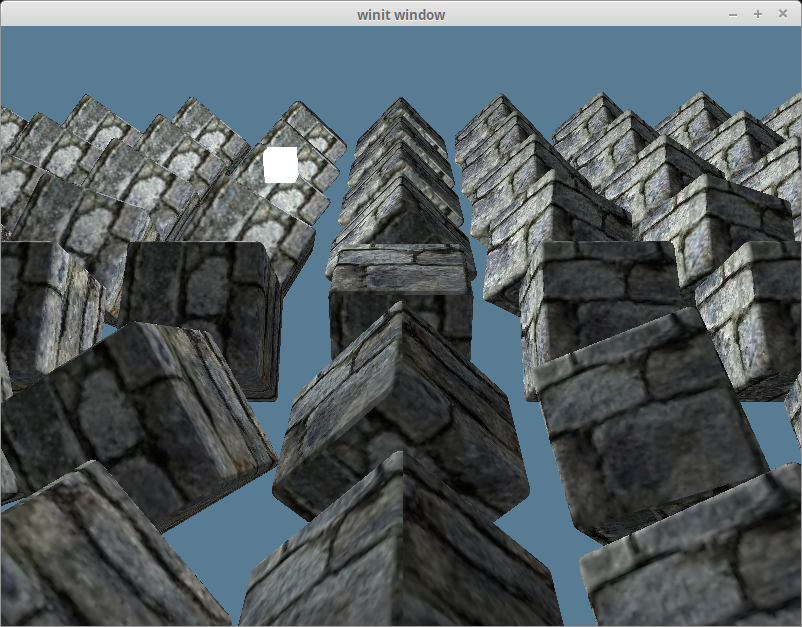

<div class="note">

如果能保证**模型矩阵**总是对**对象**应用统一的缩放因子，你就可以只使用模型矩阵了。Github 用户 @julhe 与我分享的这段代码可以做到这一点：

```rust
out.world_normal = (model_matrix * vec4f(model.normal, 0.0)).xyz;
```

他利用的是这样一个事实：即用一个 4x4 矩阵乘以一个 w 分量为 0 的向量时，只有旋转和缩放将被应用于向量。
不过你需要对这个向量进行**归一化**（Normalize）处理，因为法向量必须是**单位向量**。

模型矩阵的缩放因子*必须*是统一的才能适用。否则产生的法向量将是倾斜于表面的，如下图片所示：


</div>

## 镜面反射

**镜面反射**（Specular Reflection）模拟了现实世界中从特定角度观察物体时出现的**高光**（Highlights，亮点）。
如果曾在阳光下观察过汽车，定会注意到车身出现的高亮部分。基本上来说，我们在观察有光泽的物体时就会看到**高光**。
从表面光滑的物体上反射出去的光线会倾向于集中在一个角度的附近，所以高光的位置会根据你观察的角度而变化。

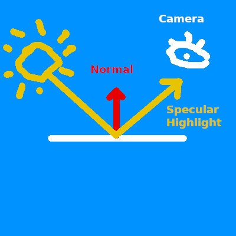

因为**镜面反射**是相对于视角而言的，所以我们需要将摄像机的位置传入顶点及片元着色器中：

```rust
struct Camera {
    view_pos: vec4f,
    view_proj: mat4x4f,
}
@group(1) @binding(0)
var<uniform> camera: Camera;
```

<div class="note">

别忘了也要更新 `light.wgsl` 中的 `Camera` 结构体，一旦它与 Rust 中的 `CameraUniform` 结构体不匹配，光照效果就会渲染错误。

</div>

同时也需要更新 `CameraUniform` 结构体：

```rust
// lib.rs
#[repr(C)]
#[derive(Copy, Clone, bytemuck::Pod, bytemuck::Zeroable)]
struct CameraUniform {
    view_position: [f32; 4],
    view_proj: [[f32; 4]; 4],
}

impl CameraUniform {
    fn new() -> Self {
        Self {
            view_position: [0.0; 4],
            view_proj: glam::Mat4::IDENTITY.into(),
        }
    }

    fn update_view_proj(&mut self, camera: &Camera) {
        // 使用 vec4 纯粹是因为 Uniform 的 16 字节对齐要求
        self.view_position = camera.eye.extend(1.0).into();
        self.view_proj = (camera.build_view_projection_matrix()).into();
    }
}
```

由于现在要在片元着色器中使用 Uniform，得修改它的可见性：

```rust
// lib.rs
let camera_bind_group_layout = device.create_bind_group_layout(&wgpu::BindGroupLayoutDescriptor {
    entries: &[
        wgpu::BindGroupLayoutBinding {
            // ...
            visibility: wgpu::ShaderStages::VERTEX | wgpu::ShaderStages::FRAGMENT, // 更新!
            // ...
        },
        // ...
    ],
    label: None,
});
```

计算从片元位置到摄像机的**方向向量**，并用此向量和法向量来计算反射方向 `reflect_dir`：

```rust
// shader.wgsl
// 片元着色器内...
let view_dir = normalize(camera.view_pos.xyz - in.world_position);
let reflect_dir = reflect(-light_dir, in.world_normal);
```

然后使用**点积**来计算镜面反射的强度 `specular_strength`，并用它算出高光颜色 `specular_color`：

```rust
let specular_strength = pow(max(dot(view_dir, reflect_dir), 0.0), 32.0);
let specular_color = specular_strength * light.color;
```

最后，将高光颜色合成到片元输出结果中：

```rust
let result = (ambient_color + diffuse_color + specular_color) * object_color.xyz;
```

完成全部代码之后，就能得到如下渲染效果：


假如只查看镜面反射得到的高光颜色 `specular_color` 本身，渲染效果如下：

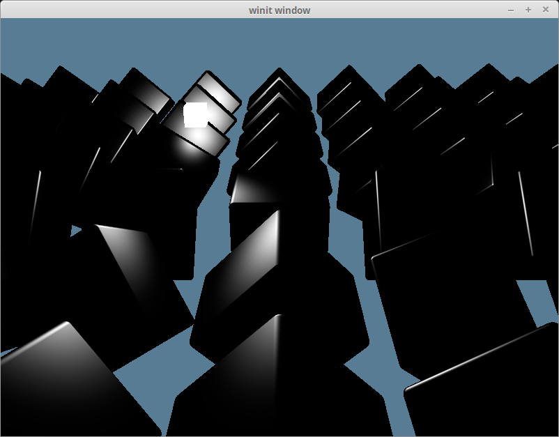

## 半程向量

所谓的**半程向量**（Halfway Vector）也是一个单位向量，它正好在视图方向和光源方向的中间。

到目前为止，我们实际上只实现了 Blinn-Phong 的 Phong 部分。Phong 反射模型很好用，但在[某些情况下](https://learnopengl.com/Advanced-Lighting/Advanced-Lighting)会产生 bug。
Blinn-Phong 的 Blinn 部分来自于这样的事实：如果把 `view_dir` 和 `light_dir` 加在一起，对结果进行**归一化**处理后得到一个**半程向量**，然后再与法向量 `normal` 求点积，就会得到大致相同的渲染结果，且不会有使用反射方向 `reflect_dir` 可能产生的问题。

```rust
let view_dir = normalize(camera.view_pos.xyz - in.world_position);
let half_dir = normalize(view_dir + light_dir);

let specular_strength = pow(max(dot(in.world_normal, half_dir), 0.0), 32.0);
```

在我们这个场景下很难看出有何不同，但以下就是改进了光照计算后的渲染效果：

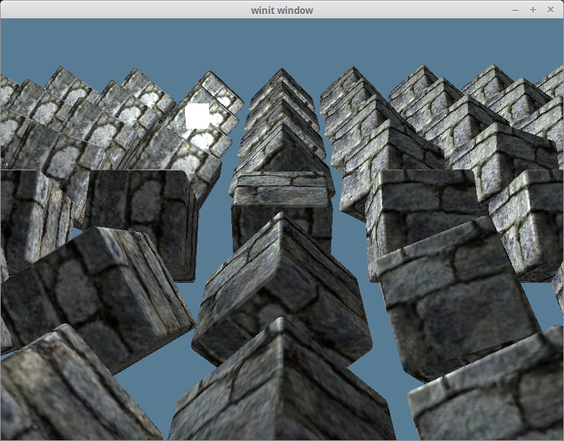

<WasmExample example="tutorial10_lighting"></WasmExample>

<AutoGithubLink/>
